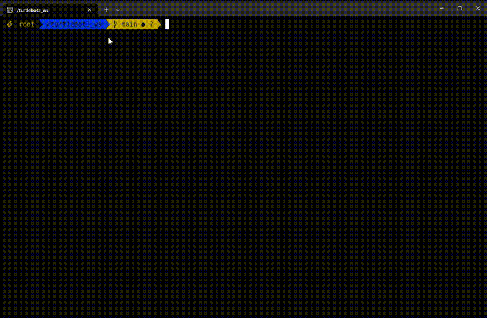

# ROS2 Dev Environment (Docker + Oh-My-Zsh + LazyVim)

[](LICENSE)

## Table of Contents

1. [About The Project](#about-the-project)  
2. [Built With](#built-with)  
3. [Getting Started](#getting-started)  
   1. [Prerequisites](#prerequisites)  
   2. [Installation](#installation)  
4. [Usage](#usage)  
5. [Notes](#notes) 
6. [License](#license)  
7. [Abstract (Japanese)](#abstract-japanese)

---

## About The Project



This is a containerized development environment for **ROS2**, designed to work on Windows 11 + WSL2 with GPU support.  
It combines **Docker**, **Oh-My-Zsh**, **powerlevel10k**, and **LazyVim (Neovim)** to provide a productive and reproducible setup for ROS2 development.

The goal of this project is:

- To provide a consistent ROS2 environment across machines  
- To integrate a modern shell and editor setup (zsh + LazyVim)  
- To simplify development and workspace management

---

## Built With

- [Docker](https://www.docker.com/) — containerization  
- [ROS2](https://docs.ros.org/) — robotics middleware  
- [Oh-My-Zsh](https://ohmyz.sh/) — zsh configuration framework  
- [powerlevel10k](https://github.com/romkatv/powerlevel10k) — zsh prompt theme  
- [LazyVim](https://www.lazyvim.org/) — Neovim configuration and plugin manager  
- (Optional) [VS Code Dev Containers](https://code.visualstudio.com/docs/devcontainers/overview)  

---

## Getting Started

### Prerequisites

This project was developed and tested on the following environment:

- **Operating System:** Windows 11 Home  
- **WSL2:** Ubuntu 24.04  
- **Docker:** WSL2 backend, version 29.0.1  
- **NVIDIA GPU support:** passthrough via WSL2, CUDA 12+ compatible  
- **Host shell:** Oh-My-Zsh + powerlevel10k (optional)  

> The containerized environment itself is fully self-contained and independent of the host shell configuration.

### Installation

1. Clone the repository  
    ```bash
    git clone https://github.com/IshiguroN/ros2-docker-lazyvim.git
    cd ros2-docker-lazyvim
    ```

2. Build the Docker image

    ```bash
    docker compose build
    ```

3. **(Optional) Open in VS Code Dev Container**
    - Open VS Code in the repository folder
    - Press `Ctrl + Shift + P` (or `Cmd + Shift + P` on macOS) to open the Command Palette
    - Type `Dev Containers: Reopen in Container` and select it
    - VS Code will build the container and attach automatically


### Usage

- **Start the container**  
    ```bash
    docker compose up -d
    ```

- **Access a shell insdide the container**
    ```bash
    docker exec -it turtlebot3_simulator /usr/bin/zsh
    ```

- **ROS2 workspace location**
    ```bash
    cd /turtlebot3_ws/src
    # You can build, run nodes, and manage your ROS2 packages here
    ```

- **Configure zsh plugins (inside container)**
    Edit `~/.zshrc` to add:
    ```text
    plugins=(git zsh-autosuggestions zsh-syntax-highlighting)
    ```
    Then reload zsh:
    ```bash
    source ~/.zshrc
    ```

- **Configure Neovim binary path (inside container)**  
    Before launching LazyVim, make sure the Neovim binary path is added:
    ```bash
    echo 'export PATH="$PATH:/opt/nvim-linux-x86_64/bin"' >> ~/.zshrc
    source ~/.zshrc
    ```
- **Launch LazyVim (NeoVim)**

    ```bash
    nvim
    ```
    Your custom configurations are located in `~/.config/nvim/`.

- **Configure LazyVim colorscheme (optional, inside container)**  
    To make LazyVim semi-transparent, create or edit the plugin file:
    ```bash
    ~/.config/nvim/plugin/colorscheme.lua
    ```
    and add the following content:
    ```lua
    return {
    { "xiyaowong/transparent.nvim" },
    { "LazyVim/LazyVim", opts = {
        colorscheme = "tokyonight",
    } },
    }
    ```
    > This will apply the `tokyonight` colorscheme with transparency.

- **Reference**

    The LazyVim transparency setup is inspired by [this Japanese article](https://qiita.com/takavfx/items/999d345f9b6c0925334a#%E4%BB%BB%E6%84%8F%E3%81%AE%E3%82%AB%E3%82%B9%E3%82%BF%E3%83%A0%E3%83%86%E3%83%BC%E3%83%9E%E3%82%92%E6%B4%BB%E3%81%8B%E3%81%97%E3%81%AA%E3%81%8C%E3%82%89%E8%83%8C%E6%99%AF%E3%82%92%E9%80%8F%E6%98%8E%E3%81%AB%E3%81%97%E3%81%9F%E3%81%84)


- **Enable ROS2 and colcon tab completion in zsh (inside container)**  
    By default, `ros2` and `colcon` tab completion does not work in zsh.  
    Run the following commands:
    ```bash
    echo 'eval "$(register-python-argcomplete3 ros2)"' >> ~/.zshrc
    echo 'eval "$(register-python-argcomplete3 colcon)"' >> ~/.zshrc
    source ~/.zshrc
    ```
    After this, tab completion for `ros2` and `colcon` commands will work in zsh.

- **Run ROS2 commands inside the container**

    1. Source the ROS2 installation:
    ```bash
    # Source ROS2 (Humble) inside container
    source /opt/ros/$ROS_DISTRO/setup.zsh
    ```

2. Navigate to your workspace and build:
    ```bash
    cd /turtlebot3_ws
    colcon build --symlink-install --cmake-args -DCMAKE_EXPORT_COMPILE_COMMANDS=ON
    ```
    Now compile_commands.json will be generated in each package’s build/ folder, which can be used by editors like LazyVim for LSP features.

3. Source your workspace:
    ```bash
    source /turtlebot3_ws/install/setup.zsh
    ```

4. (Optional) If you want to use Gazebo, source Gazebo setup:
    ```bash
    source /usr/share/gazebo/setup.sh
    ```
    Now you can run ROS2 commands, launch nodes, or start simulations inside the container.

5. (Optional) To run TurtleBot3 in Gazebo:
    - Install the required packages in `src` following the official tutorial:
        - https://emanual.robotis.com/docs/en/platform/turtlebot3/quick-start/
        - https://emanual.robotis.com/docs/en/platform/turtlebot3/simulation/#gazebo-simulation
    - Then rebuild your workspace
    ```bash
    colcon build --symlink-install
    export TURTLEBOT3_MODEL=waffle_pi
    source /turtlebot3_ws/install/setup.zsh
    ```
#### Stop and rebuild the container
- **Stop the container when done**
    ```bash
    docker compose down
    ```

- **Rebuild after changes to Dockerfile**
    ```bash
    docker compose build --no-cache
    docker compose up -d
    ```

### Notes

- The container environment is **fully self-contained** and does not depend on the host shell (zsh, powerlevel10k).  
- **GPU usage is limited**:
  - NVIDIA GPUs are supported via WSL2 / Docker (CUDA 12+).  
  - macOS GPU (MPS) is **not supported**.  
  - ARM64 architecture is **not supported**; this setup assumes x86_64.  
- ROS2 build artifacts (`build/`, `install/`, `log/`) are ignored via `.gitignore`.  
- Additional tools can be added in the Dockerfile to make the environment reproducible.

- **GPU Usage**: The current `docker-compose.yml` is configured for NVIDIA GPU passthrough.  
  If your machine does not have an NVIDIA GPU and you want to run on CPU, comment out the following section in `docker-compose.yml`:

```yaml
deploy:
  resources:
    reservations:
      devices:
        - driver: nvidia
          count: 1
          capabilities: [gpu]
```

## License

This project is licensed under the **MIT License**.  
See the [LICENSE](LICENSE) file for details.


## Abstract (Japanese)

### プロジェクト概要
- Windows 11 + WSL2 上で動く **ROS2 開発用 Docker 環境**  
- Oh-My-Zsh + powerlevel10k + LazyVim を組み合わせた開発者向け設定  
- 環境をコンテナ化することで **マシン依存なく再現可能** 
 

### 必要環境
- Windows 11 Home  
- WSL2 (Ubuntu 24.04)  
- Docker（WSL2 backend）  
- NVIDIA GPU があれば CUDA 12 以上で利用可能  
- ホストの zsh / powerlevel10k は任意  

### インストール手順
1. リポジトリをクローン  
2. Docker イメージをビルド  
3. （任意）VS Code で **Dev Container** として開く  
   - `Ctrl + Shift + P` → `Dev Containers: Reopen in Container` を選択  

### 使用方法
- コンテナ起動: `docker compose up -d`  
- コンテナ内シェルアクセス: `docker exec -it turtlebot3_simulator /usr/bin/zsh`  
- ROS2 ワークスペース: `/turtlebot3_ws/src`  
- LazyVim 起動: `nvim`  
- ROS2 コマンド例:  
  ```bash
  source /turtlebot3_ws/install/setup.bash
  ros2 node list
  ```
- コンテナ停止: `docker compose down`

### 注意点
- コンテナ環境は ホストシェルに依存しない
- ROS2 のビルド成果物（build / install / log）は .gitignore で管理
- 必要に応じて Dockerfile にツールを追加可能

### ライセンス
- MIT License

